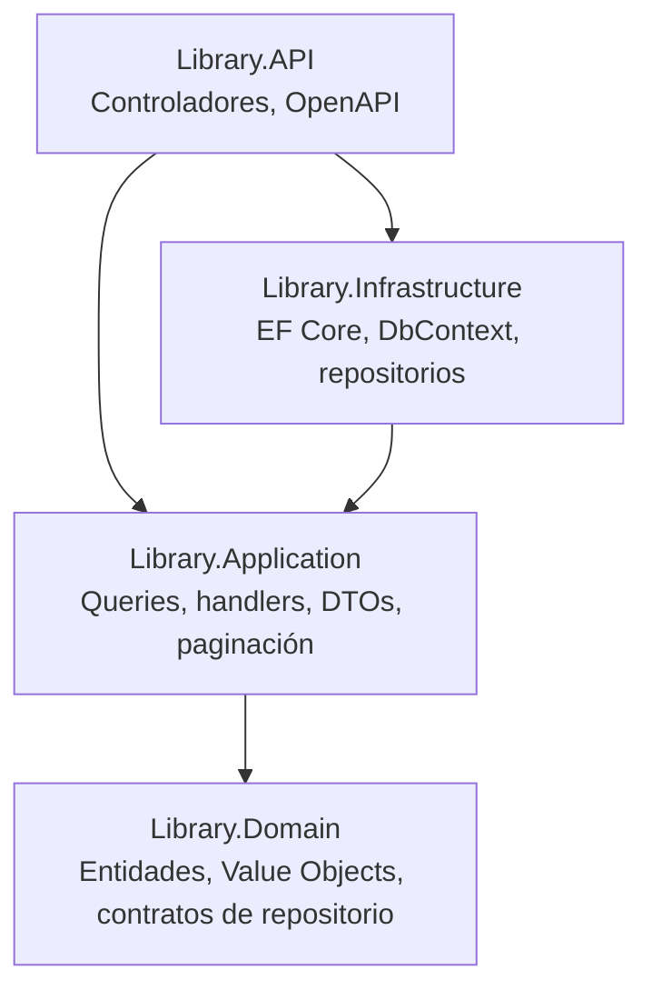

# Sistema de Consulta de Catálogo de Biblioteca

API REST para consultar la información de los libros, autores y categorías del catálogo de una biblioteca. Desarrollada con **Clean Architecture**, **Domain-Driven Design (DDD)** y **CQRS**, usando **Entity Framework Core** sobre **SQL Server**.

Repositorio: https://github.com/Ciarango10/library-catalog

---

## Tabla de contenido

- [Descripción del caso](#descripción-del-caso)
- [Cumplimiento de requisitos](#cumplimiento-de-requisitos)
- [Arquitectura](#arquitectura)
- [Tecnologías](#tecnologías)
- [Estructura del proyecto](#estructura-del-proyecto)
- [Requisitos previos](#requisitos-previos)
- [Cómo ejecutar el proyecto](#cómo-ejecutar-el-proyecto)
- [Endpoints disponibles](#endpoints-disponibles)
- [Datos de ejemplo](#datos-de-ejemplo)
- [Pruebas](#pruebas)
- [Flujo de trabajo con Git](#flujo-de-trabajo-con-git)
- [Integrantes del equipo](#integrantes-del-equipo)

---

## Descripción del caso

Una biblioteca necesita una aplicación que permita consultar de manera organizada la información de su catálogo, que actualmente se encuentra dispersa en diferentes registros.

En esta primera versión el sistema es **de solo lectura**: permite consultar libros, autores y categorías, pero **no registrar, modificar ni eliminar información**. El objetivo es construir únicamente la infraestructura necesaria para consultar la información existente en el catálogo.

### Casos de uso implementados (CQRS)

| Query | Descripción | Query / Handler | Endpoint |
|-------|-------------|-----------------|----------|
| **Query 1** – Consultar todos los libros | Listado de libros con Id, título, ISBN, año de publicación, autor y categoría | `GetAllBooksQuery` / `GetAllBooksQueryHandler` | `GET /api/books` |
| **Query 2** – Consultar un libro por ID | Detalle de un libro, incluyendo su autor y su categoría | `GetBookByIdQuery` / `GetBookByIdQueryHandler` | `GET /api/books/{id}` |
| **Query 3** – Consultar libros por categoría | Libros que pertenecen a una categoría determinada (paginado) | `GetBooksByCategoryQuery` / `GetBooksByCategoryQueryHandler` | `GET /api/categories/{categoryId}/books` |

---

## Cumplimiento de requisitos

| Requisito del caso de estudio | Cómo se cumple |
|-------------------------------|----------------|
| Clean Architecture | Solución dividida en `Domain`, `Application`, `Infrastructure` y `API`, con dependencias hacia el dominio. |
| Domain-Driven Design | Entidades `Book`, `Author` y `Category` con invariantes; Value Objects `Isbn` y `PublicationYear`; contratos de repositorio en el dominio. |
| CQRS | Cada caso de uso es una query independiente con su propio handler, despachada con MediatR. No existen comandos, porque el sistema es de solo lectura. |
| SQL Server + EF Core | `LibraryDbContext` con configuraciones Fluent API, migración `InitialCatalog` y datos semilla. |
| Git + GitHub | Ramas por historia de usuario, Pull Requests hacia `develop` y repositorio público en GitHub. |

---

## Arquitectura

La solución sigue **Clean Architecture**: las dependencias apuntan siempre hacia el centro, y el dominio no depende de ninguna otra capa.



| Capa | Responsabilidad |
|------|-----------------|
| **Library.Domain** | Núcleo del negocio: entidades (`Book`, `Author`, `Category`), Value Objects (`Isbn`, `PublicationYear`), excepción `DomainException` y contratos `IBookRepository` e `ICategoryRepository`. No depende de ninguna otra capa. |
| **Library.Application** | Casos de uso implementados como queries CQRS con MediatR, DTOs (`BookDto`, `BookDetailDto`), mapeos y utilidades de paginación (`PaginationRequest`, `PaginationResponse<T>`). |
| **Library.Infrastructure** | Persistencia con EF Core y SQL Server: `LibraryDbContext`, configuraciones Fluent API, migraciones, datos semilla e implementación de los repositorios. |
| **Library.API** | Punto de entrada HTTP: controladores `BooksController` y `CategoriesController`, y documento OpenAPI. |
| **Library.Tests** | Pruebas unitarias del dominio, de los handlers y de los repositorios. |

### Patrones aplicados

- **DDD:** entidades con `private set` y constructores que validan sus datos; Value Objects con igualdad por valor (`ValueObject`) que rechazan valores inválidos (ISBN con dígito de control incorrecto, años negativos o futuros).
- **CQRS:** cada consulta es una query independiente con su propio handler, despachada mediante `ISender` de MediatR desde los controladores.
- **Repository:** la capa de aplicación consulta los datos a través de `IBookRepository` e `ICategoryRepository`, sin conocer EF Core.
- **Paginación:** la Query 3 devuelve un `PaginationResponse<BookDto>` con los elementos de la página, el total de registros y la información de navegación.
- **Inyección de dependencias:** cada capa se registra con su método de extensión (`AddApplication()`, `AddInfrastructure()`).

---

## Tecnologías

| Tecnología | Versión | Uso |
|------------|---------|-----|
| .NET / C# | 9.0 | Plataforma y lenguaje |
| ASP.NET Core Web API | 9.0 | Exposición de endpoints REST |
| Microsoft.AspNetCore.OpenApi | 9.0.1 | Documento OpenAPI de la API |
| Entity Framework Core (SqlServer, Design) | 9.0.20 | ORM y migraciones |
| SQL Server / LocalDB | — | Base de datos |
| MediatR | 12.4.1 | Implementación de CQRS |
| xUnit | 2.9.2 | Pruebas unitarias |
| EF Core SQLite | 9.0.20 | Base de datos en memoria para las pruebas de repositorios |
| Git + GitHub | — | Control de versiones y trabajo colaborativo |

---

## Estructura del proyecto

```
library-catalog/
├── src/
│   ├── Library.Domain/
│   │   ├── Common/              # Clases base Entity y ValueObject
│   │   ├── Entities/            # Book, Author, Category
│   │   ├── Exceptions/          # DomainException
│   │   ├── Repositories/        # IBookRepository, ICategoryRepository
│   │   └── ValueObjects/        # Isbn, PublicationYear
│   ├── Library.Application/
│   │   ├── Books/
│   │   │   ├── Dtos/            # BookDto, BookDetailDto, AuthorDto, CategoryDto
│   │   │   ├── Mappers/         # BookMapperExtensions
│   │   │   └── Queries/         # GetAllBooks, GetBookById, GetBooksByCategory
│   │   ├── Utilities/Pagination/# PaginationRequest, PaginationResponse<T>
│   │   └── DependencyInjection.cs
│   ├── Library.Infrastructure/
│   │   ├── Extensions/          # QueryableExtensions (paginación)
│   │   ├── Persistence/
│   │   │   ├── Configurations/  # Fluent API y datos semilla
│   │   │   ├── Migrations/      # InitialCatalog
│   │   │   └── LibraryDbContext.cs
│   │   ├── Repositories/        # BookRepository, CategoryRepository
│   │   └── DependencyInjection.cs
│   └── Library.API/
│       ├── Controllers/         # BooksController, CategoriesController
│       ├── Library.API.http     # Peticiones de ejemplo
│       └── Program.cs
├── tests/
│   └── Library.Tests/
│       ├── Domain/              # Entidades y Value Objects
│       ├── Application/         # Handlers y paginación
│       └── Infrastructure/      # Repositorios con SQLite en memoria
├── dotnet-tools.json            # Herramienta local dotnet-ef
├── Library.sln
└── README.md
```

---

## Cómo ejecutar el proyecto

### 1. Clonar el repositorio

```bash
git clone https://github.com/Ciarango10/library-catalog.git
cd library-catalog
```

### 2. Configurar la cadena de conexión

La cadena de conexión `DefaultConnection` está en `src/Library.API/appsettings.json`. Por defecto usa **LocalDB**:

```json
"ConnectionStrings": {
  "DefaultConnection": "Server=(localdb)\\MSSQLLocalDB;Database=LibraryCatalog;Trusted_Connection=True;TrustServerCertificate=True"
}
```

Si usas una instancia local de **SQL Server** (Express o Developer), cámbiala por:

```json
"ConnectionStrings": {
  "DefaultConnection": "Server=localhost;Database=LibraryCatalog;Trusted_Connection=True;TrustServerCertificate=True"
}
```

### 3. Crear la base de datos

Desde la raíz del repositorio, aplica las migraciones. Esto crea la base de datos `LibraryCatalog` con sus tablas y los [datos de ejemplo](#datos-de-ejemplo):

```bash
dotnet tool restore
dotnet ef database update --project src/Library.Infrastructure --startup-project src/Library.API
```

> En Visual Studio también puedes usar la **Consola del Administrador de Paquetes** con `Library.Infrastructure` como proyecto predeterminado y `Library.API` como proyecto de inicio:
> ```powershell
> Update-Database
> ```

### 4. Ejecutar la API

```bash
dotnet run --project src/Library.API --launch-profile https
```

O en Visual Studio: establece `Library.API` como proyecto de inicio y presiona **F5**.

La API queda disponible en:

- `https://localhost:7125`
- `http://localhost:5068`

### 5. Probar los endpoints

- **Archivo `.http`:** `src/Library.API/Library.API.http` tiene una petición lista para cada query; se ejecuta desde Visual Studio o VS Code (extensión REST Client).
- **Documento OpenAPI:** en entorno de desarrollo se publica en `https://localhost:7125/openapi/v1.json`, que puede importarse en Postman.
- **Navegador o curl:**

```bash
curl https://localhost:7125/api/books
```

---

## Endpoints disponibles

| Método | Ruta | Query | Descripción | Respuestas |
|--------|------|-------|-------------|------------|
| `GET` | `/api/books` | Query 1 | Lista todos los libros del catálogo | `200` con la lista (vacía si no hay libros) |
| `GET` | `/api/books/{id}` | Query 2 | Detalle de un libro con su autor y su categoría | `200` si existe · `404` si no existe |
| `GET` | `/api/categories/{categoryId}/books?pageNumber=1&pageSize=15` | Query 3 | Libros de una categoría, paginados | `200` con la página (vacía si la categoría no tiene libros) · `404` si la categoría no existe |

Parámetros de paginación de la Query 3 (opcionales):

| Parámetro | Por defecto | Regla |
|-----------|-------------|-------|
| `pageNumber` | `1` | Si es menor que 1, se usa 1 |
| `pageSize` | `15` | Máximo `50`; si es menor que 1, se usa 15 |

### Query 1: `GET /api/books`

```json
[
  {
    "id": 1,
    "title": "Arquitectura de software",
    "isbn": "9780000000019",
    "publicationYear": 2018,
    "author": "Ana Torres",
    "category": "Tecnología"
  }
]
```

### Query 2: `GET /api/books/1`

```json
{
  "id": 1,
  "title": "Arquitectura de software",
  "isbn": "9780000000019",
  "publicationYear": 2018,
  "author": { "id": 1, "name": "Ana Torres" },
  "category": { "id": 1, "name": "Tecnología" }
}
```

### Query 3: `GET /api/categories/1/books?pageNumber=1&pageSize=2`

```json
{
  "items": [
    {
      "id": 1,
      "title": "Arquitectura de software",
      "isbn": "9780000000019",
      "publicationYear": 2018,
      "author": "Ana Torres",
      "category": "Tecnología"
    },
    {
      "id": 2,
      "title": "Fundamentos de bases de datos",
      "isbn": "9780000000026",
      "publicationYear": 2016,
      "author": "Carlos Méndez",
      "category": "Tecnología"
    }
  ],
  "totalCount": 4,
  "pageNumber": 1,
  "pageSize": 2,
  "totalPages": 2,
  "hasPreviousPage": false,
  "hasNextPage": true
}
```

### Respuesta cuando el recurso no existe

Cuando el libro o la categoría no existen, la API responde `404 Not Found` con el formato estándar `ProblemDetails` de ASP.NET Core:

```json
{
  "type": "https://tools.ietf.org/html/rfc9110#section-15.5.5",
  "title": "Not Found",
  "status": 404,
  "traceId": "00-..."
}
```

---

## Datos de ejemplo

La migración `InitialCatalog` carga estos datos semilla:

| Categoría | Libros |
|-----------|--------|
| **1 – Tecnología** | Arquitectura de software · Fundamentos de bases de datos · Redes distribuidas · Patrones de diseño |
| **2 – Ciencias** | Historia de la ciencia · Álgebra lineal aplicada · Cálculo para ingeniería |
| **3 – Literatura** | Literatura latinoamericana · Narrativas contemporáneas · Poesía y memoria |

Autores: Ana Torres, Carlos Méndez, Laura Ramírez, Diego Vargas y Sofía Herrera.

---

## Pruebas

El proyecto `Library.Tests` contiene pruebas unitarias con xUnit que cubren:

- **Dominio:** validaciones de `Book`, `Author` y `Category`; rechazo de ISBN inválidos y de años de publicación futuros o negativos.
- **Aplicación:** los 3 handlers de las queries, usando repositorios falsos (`FakeBookRepository`, `FakeCategoryRepository`), y la normalización de la paginación.
- **Infraestructura:** `BookRepository` y `CategoryRepository` contra una base de datos SQLite en memoria.

Para ejecutarlas:

```bash
dotnet test
```

O en Visual Studio: menú **Prueba → Ejecutar todas las pruebas**.

---

## Flujo de trabajo con Git

| Rama | Propósito |
|------|-----------|
| `main` | Versión estable y entregable |
| `develop` | Integración del trabajo del equipo |
| `feature/...` | Una rama por cada grupo de historias de usuario (por ejemplo, `feature/HU13-HU14-HU15`) |

Reglas del repositorio:

1. Cada integrante trabaja en su rama `feature/...`, creada a partir de `develop`.
2. Los commits se nombran con la historia de usuario que implementan (por ejemplo, `HU-11: query para consultar todos los libros`).
3. Los cambios se integran a `develop` **solo mediante Pull Request**, revisado y aprobado por otro integrante.
4. Las ramas `main` y `develop` están protegidas con un ruleset: no se permiten pushes directos.
5. Al finalizar, `develop` se integra a `main` mediante Pull Request.

---

## Integrantes del equipo

Carlos Iván Arango Londoño 
David Santiago Viloria Romero 
Victor Manuel David Rodriguez
Juana Maria Ospina Castillo
Samuel Metaute Restrepo 